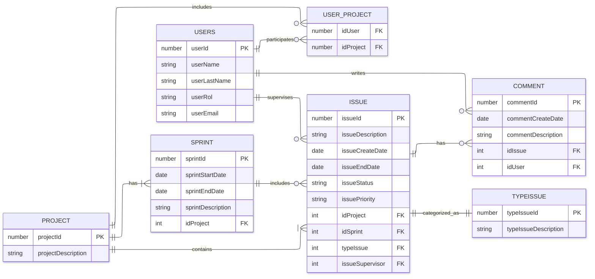

# Propuesta TP DSW

## Grupo
### Integrantes

* 49069 - Tarrago, Juan Manuel
* 42710 - Portillo, Lucía

### Repositorios
* [frontend app](https://github.com/juanma414/dswFrontend)
* [backend app](https://github.com/juanma414/dswBackend)

## Tema
Aplicación para gestión de tareas estilo Trello o Jira
### Descripción
El objetivo principal de la aplicación es organizar y gestionar el trabajo de forma eficiente. Permitiendo a los usuarios crear, organizar y realizar un seguimiento de tareas, proyectos y objetivos, tanto individualmente como en equipo.

Funciones principales:
* Creación de tareas: Permite crear tareas con diferentes niveles de detalle, incluyendo título, descripción, etiquetas, prioridad, fecha límite y asignación a un responsable.
* Organización de tareas: Las tareas se pueden organizar en diferentes tableros, listas o categorías, según el flujo de trabajo del proyecto.
* Seguimiento del progreso: Permite realizar un seguimiento del progreso de las tareas, incluyendo su estado actual, avance y tiempo restante.
* Colaboración: Facilita la colaboración entre equipos y usuarios, permitiendo la comunicación y el intercambio de información sobre las tareas.
* Informes y análisis: Ofrece informes y análisis para ayudar a los equipos a mejorar su rendimiento.*

### Modelo
Desde Draw.io con las diferentes versiones --> https://drive.google.com/file/d/1Miob85r-dn_M9zWg0FZaVY0_oawiB9GY/view?usp=drive_link

Versión final del Modelo: 

## Alcance Funcional 

### Alcance Mínimo

Regularidad:
|Req|Detalle|
|:-|:-|
|CRUD simple|1. CRUD Usuario  2. CRUD Incidencia  3. CRUD Proyecto|
|CRUD dependiente|1. CRUD Comentario {depende de} CRUD Incidencia 2. CRUD Incidencia {depende de} CRUD Proyecto |
|Listado + detalle| 1. Listado de incidencias filtrado por tipo, muestra nro y tipo de incidencia => detalle CRUD Incidencia  2. Listado de Incidencias filtrado por rango de fecha, muestra nro de incidencia, fecha inicio y fin fin, estado y nombre del usuario responsable => detalle muestra datos completos de las incidencias|
|CUU/Epic|1. Armar una Sprint.  2. Registro del avance de una Incidencia en donde se ve si se completó y que estado tienen las mismas.

Adicionales para Aprobación
|Req|Detalle|
|:-|:-|
|CRUD simple|1. CRUD Usuario  2. CRUD Incidencia  3. CRUD Proyecto  4. CRUD Tipo de Incidencia   5. CRUD Sprint|
|CUU/Epic|1. Reporte con toda la información dentro de un Sprint|

### Alcance Adicional Voluntario

*Nota*: El Alcance Adicional Voluntario es opcional, pero ayuda a que la funcionalidad del sistema esté completa y será considerado en la nota en función de su complejidad y esfuerzo.

|Req|Detalle|
|:-|:-|
|Listados |1.   2. |
|CUU/Epic|1.  2. |
|Otros|1. |

